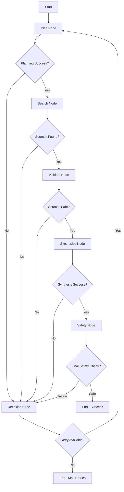

# Research Assistant Agent with LangGraph & Gemini 2.0 Flash

A sophisticated research assistant that combines **LangGraph** orchestration with **Gemini 2.0 Flash** for fast, cost-effective research with built-in safety guardrails and self-improvement capabilities.

## Architecture Overview

**LangGraph** orchestrates a stateful graph with nodes for reasoning, acting, and safety validation. **Gemini 2.0 Flash** serves as the LLM for fast, cost-effective inference. The agent follows ReAct pattern with planning layer and reflexion for self-improvement.

### Core Components

- **State Management**: `TypedDict` with research_query, plan, sources, draft, safety_checks
- **Graph Nodes**: `plan_node` → `search_node` → `validate_node` → `synthesize_node` → `safety_node`
- **LLM Integration**: `ChatGoogleGenerativeAI(model="gemini-2.0-flash-exp", temperature=0.1)`
- **Tools**: `TavilySearchTool` for web search, `StructuredOutputParser` for formatted responses
- **Safety Guardrails**: URL whitelist validation, content filtering, rate limiting
- **Conditional Edges**: Routes based on safety validation (safe→continue, unsafe→escalate, retry→reflexion)
- **Checkpointing**: `MemorySaver` for state persistence, enables interruption/resumption
- **Reflexion Loop**: Failed attempts trigger self-critique node that updates plan before retry

## Quick Start

### Installation

```bash
# Clone the repository
git clone https://github.com/Amruth22/W1D11S2-Langgraph-ReAct-implementation.git
cd W1D11S2-Langgraph-ReAct-implementation

# Install dependencies
pip install -r requirements.txt

# API keys are already configured in .env file
# For your own setup: cp .env.example .env and edit with your keys
```

### Environment Setup

The API keys are already configured in the `.env` file:

```env
GEMINI_API_KEY=
TAVILY_API_KEY=
```

For your own setup, copy `.env.example` to `.env` and add your API keys:

```bash
cp .env.example .env
# Edit .env with your actual API keys and JWT secret
```

### Basic Usage

```python
import asyncio
from src.graph import research_query

async def main():
    result = await research_query("What are the latest developments in quantum computing?")
    print(result['draft'])

asyncio.run(main())
```

### Command Line Interface

```bash
# Basic research
python -m src.main "What are the latest developments in AI?"

# With checkpointing
python -m src.main "Climate change impacts" --thread-id my_research_1

# Resume from checkpoint
python -m src.main --resume --thread-id my_research_1

# Show execution history
python -m src.main --history --thread-id my_research_1

# Show configuration
python -m src.main --config

# Run examples
python -m src.main --examples
```

### FastAPI Web Interface

```bash
# Start API server (development)
python run_api.py --host 0.0.0.0 --port 8080 --reload

# Start API server (production)
python run_api.py --host 0.0.0.0 --port 8080 --workers 4
```

Then access:
- **API Server**: http://0.0.0.0:8080
- **Interactive Docs**: http://0.0.0.0:8080/docs
- **Health Check**: http://0.0.0.0:8080/health

### API Testing

```bash
# Python API client test
python api_examples/test_api.py

# Curl examples
chmod +x api_examples/curl_examples.sh
./api_examples/curl_examples.sh

# Smart integration tests
python unit_test.py
```

## Workflow Architecture



## Core Features

### 1. ReAct Pattern Implementation

- **Reasoning**: Planning and synthesis nodes analyze and plan research
- **Acting**: Search node executes queries and gathers information
- **Observation**: Validation nodes assess results and safety

### 2. Safety Guardrails

```python
# URL Validation
trusted_domains = {
    "wikipedia.org", "arxiv.org", "pubmed.ncbi.nlm.nih.gov",
    "scholar.google.com", "ieee.org", "nature.com", "science.org"
}

# Content Moderation
blocked_keywords = ["violence", "hate", "harassment", "illegal", "harmful"]

# Rate Limiting
rate_limiter = TokenBucket(capacity=60, refill_rate=1.0)
```

### 3. Reflexion & Self-Improvement

When failures occur, the agent:
1. Analyzes what went wrong
2. Identifies specific issues
3. Suggests improvements
4. Revises the research plan
5. Retries with updated approach (max 3 attempts)

### 4. State Persistence

```python
# Checkpointing enables resumption
workflow = ResearchWorkflow()
result = await workflow.run_research(query, thread_id="my_research")

# Resume later
resumed_result = await workflow.resume_from_checkpoint("my_research")
```

### 5. Automatic Report Saving

```python
# Reports are automatically saved to ./reports/ directory
# Filename format: YYYYMMDD_HHMMSS_[thread_id_]query.md

# Example saved file: 20241218_143022_ai_research_What_are_the_latest_developments_in_AI.md
```

## Project Structure

```
W1D11S2-Langgraph-ReAct-implementation/
├── src/
│   ├── __init__.py          # Package initialization
│   ├── config.py            # Configuration management
│   ├── state.py             # State definitions (TypedDict)
│   ├── safety.py            # Safety validation components
│   ├── tools.py             # Tavily & Gemini integrations
│   ├── nodes.py             # LangGraph nodes implementation
│   ├── graph.py             # Workflow orchestration
│   └── main.py              # CLI application
├── examples/
│   └── basic_usage.py       # Usage examples
├── tests/
│   └── test_basic.py        # Basic tests
├── requirements.txt         # Dependencies
├── .env.example            # Environment template
└── README.md               # This file
```

## Advanced Usage

### Custom Workflow Configuration

```python
from src.graph import ResearchWorkflow
from src.config import Config

# Customize configuration
Config.MAX_RETRIES = 5
Config.TEMPERATURE = 0.2
Config.MAX_SEARCH_RESULTS = 15

# Create workflow with custom settings
workflow = ResearchWorkflow()
result = await workflow.run_research("Your query here")
```

### Batch Research Processing

```python
import asyncio
from src.graph import research_query

async def batch_research(queries):
    tasks = []
    for i, query in enumerate(queries):
        task = research_query(query, thread_id=f"batch_{i}")
        tasks.append(task)
    
    results = await asyncio.gather(*tasks, return_exceptions=True)
    return results

# Usage
queries = [
    "Latest AI developments",
    "Climate change solutions", 
    "Quantum computing breakthroughs"
]

results = await batch_research(queries)
```

### Custom Safety Validation

```python
from src.safety import SafetyValidator, ContentModerationChain

# Add custom blocked keywords
custom_keywords = ["custom_blocked_term", "another_term"]
moderator = ContentModerationChain(custom_keywords)

# Custom domain validation
custom_domains = {"your-trusted-domain.com", "another-domain.org"}
validator = SafetyValidator()
validator.url_validator.trusted_domains.update(custom_domains)
```

## Testing

### Smart API Integration Tests (Recommended)
```bash
# Start the API server first
python run_api.py --host 0.0.0.0 --port 8080 --reload

# In another terminal, run comprehensive API tests
python unit_test.py
```

These tests intelligently:
- ✅ Test real API functionality on 0.0.0.0:8080
- ✅ Validate authentication and authorization
- ✅ Test research workflow execution
- ✅ Check audit logging and user management
- ✅ Handle API availability gracefully
- ✅ Provide clear guidance for issues

### Basic Component Tests
```bash
# Run basic component tests
python tests/test_basic.py

# Run with pytest (if installed)
pytest tests/

# Run examples
python examples/basic_usage.py
```

## Performance & Optimization

### Token Efficiency
- **Differential Editing**: Uses structured parsing to minimize token usage
- **Selective Content**: Only processes relevant search results
- **Caching**: Checkpointing reduces redundant processing

### Rate Limiting
- **Token Bucket**: Prevents API rate limit violations
- **Adaptive Delays**: Automatically handles rate limit responses
- **Concurrent Safety**: Thread-safe rate limiting implementation

### Memory Management
- **Streaming Processing**: Handles large search results efficiently
- **State Cleanup**: Automatic cleanup of temporary data
- **Checkpoint Compression**: Efficient state serialization

## Security Features

### Content Safety
- **Multi-layer Validation**: URL, content, and output validation
- **Keyword Filtering**: Blocks harmful content patterns
- **Confidence Scoring**: Assesses safety confidence levels

### Data Privacy
- **No Persistent Storage**: Research data not permanently stored
- **API Key Security**: Secure handling of authentication
- **Audit Logging**: Tracks safety violations and errors

## Contributing

1. Fork the repository
2. Create a feature branch (`git checkout -b feature/amazing-feature`)
3. Commit your changes (`git commit -m 'Add amazing feature'`)
4. Push to the branch (`git push origin feature/amazing-feature`)
5. Open a Pull Request

### Development Setup

```bash
# Install development dependencies
pip install -r requirements.txt
pip install pytest black flake8

# Run tests
python tests/test_basic.py

# Format code
black src/ tests/ examples/

# Lint code
flake8 src/ tests/ examples/
```

## API Reference

### Core Functions

#### `research_query(query: str, thread_id: str = None) -> ResearchState`
Convenience function for simple research queries.

#### `ResearchWorkflow.run_research(query: str, thread_id: str = None) -> ResearchState`
Full workflow execution with checkpointing support.

#### `ResearchWorkflow.resume_from_checkpoint(thread_id: str) -> ResearchState`
Resume execution from a saved checkpoint.

### State Structure

```python
class ResearchState(TypedDict):
    research_query: str          # Original research question
    plan: str                    # Research plan
    sources: List[SearchResult]  # Found sources
    draft: str                   # Final research output
    safety_checks: List[SafetyCheck]  # Safety validation results
    is_safe: bool               # Overall safety status
    current_step: str           # Current workflow step
    retry_count: int            # Number of retries attempted
    errors: List[str]           # Error messages
    warnings: List[str]         # Warning messages
```

## Troubleshooting

### Common Issues

1. **API Key Errors**
   ```bash
   # Check configuration
   python -m src.main --config
   ```

2. **Rate Limiting**
   ```python
   # Adjust rate limits in config.py
   RATE_LIMIT_REQUESTS_PER_MINUTE = 30  # Reduce if needed
   ```

3. **Memory Issues**
   ```python
   # Reduce search results
   MAX_SEARCH_RESULTS = 5
   MAX_OUTPUT_TOKENS = 500
   ```

4. **Safety Validation Failures**
   ```python
   # Check trusted domains and blocked keywords in config.py
   # Add your domains to TRUSTED_DOMAINS set
   ```

## License

This project is licensed under the MIT License - see the [LICENSE](LICENSE) file for details.

## Acknowledgments

- **LangGraph** for workflow orchestration
- **Google Gemini** for fast LLM inference
- **Tavily** for reliable web search
- **ReAct Pattern** research for the architectural foundation

## Support

- Create an [Issue](https://github.com/Amruth22/W1D11S2-Langgraph-ReAct-implementation/issues) for bug reports
- Start a [Discussion](https://github.com/Amruth22/W1D11S2-Langgraph-ReAct-implementation/discussions) for questions
- Check [Examples](examples/) for usage patterns

---

**Built using LangGraph & Gemini 2.0 Flash**
